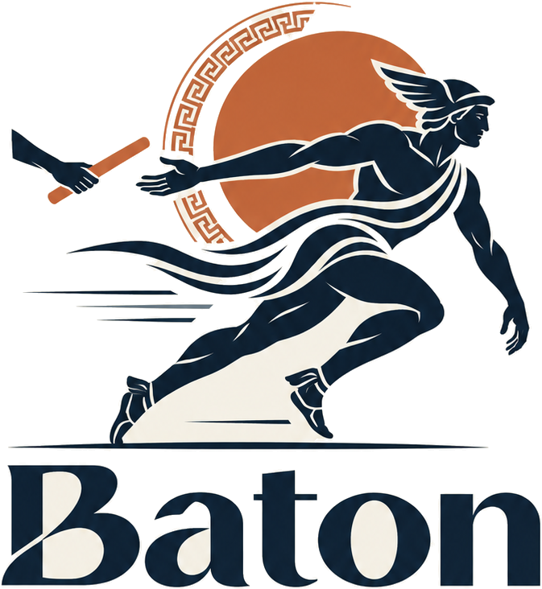
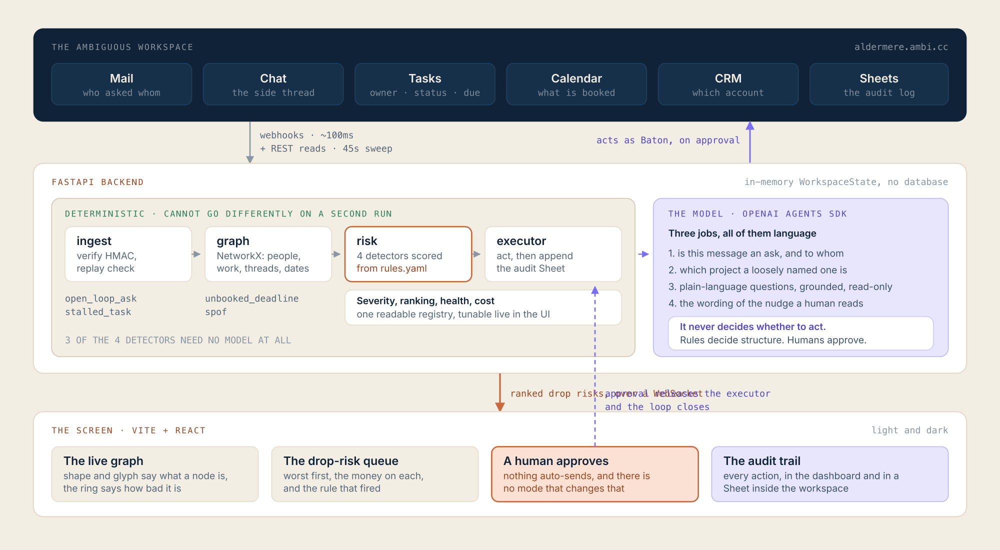
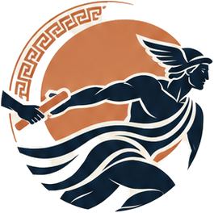

<p align="center">
  <picture>
    <source media="(prefers-color-scheme: dark)" srcset="assets/readme/baton-logo-reversed.png">
    
  </picture>
</p>

<p align="center"><i>never drop the baton</i></p>

<p align="center">
  An AI coworker that lives inside your team's <b>Ambiguous</b> workspace, holds the whole graph of<br>
  <b>who owes whom what</b>, and catches the work about to fall through the cracks. It finds the ask nobody<br>
  answered, the task that stopped moving, the deadline nobody booked and the <b>single point of failure</b>,<br>
  then hands each one off with a governed, one-click fix. Nothing auto-sends. Everything is logged.
</p>

<p align="center">
  <b>Best Use of Ambiguous AI</b> &nbsp;·&nbsp; Agents, Everywhere (AI Tinkerers x OpenAI) &nbsp;·&nbsp; Drafts-only, human-in-the-loop
</p>

<p align="center">
  <a href="#run-it-in-two-commands"><b>◆ Run it in two commands&nbsp;→</b></a>
  &nbsp;&nbsp;·&nbsp;&nbsp;
  <a href="#what-gets-dropped">What gets dropped</a>
  &nbsp;&nbsp;·&nbsp;&nbsp;
  <a href="#who-it-is-for">Who it is for</a>
  &nbsp;&nbsp;·&nbsp;&nbsp;
  <a href="#architecture">Architecture</a>
  &nbsp;&nbsp;·&nbsp;&nbsp;
  <a href="#what-this-is-not">What this is not</a>
</p>

<p align="center">
  
  
  
  
  
  &nbsp;
  
  
</p>

<p align="center">
  
</p>

---

## The problem

Work does not usually fail because somebody cannot do it. It fails at the **hand-off**.

An ask goes into a thread with five recipients, so it is addressed to nobody. A task stops moving
while the board still says *in progress*, because the signal is an **absence** and an absence is
exactly what a human does not notice. A date everyone agreed never reaches a calendar, so nothing
in the system will ever mention it again. And one person quietly becomes the only way four critical
things happen, which is not written in any record at all: it is a property of the *shape* of the
work.

Nobody's job is to notice any of this, and three of the four are invisible from inside a single app.

---

## What gets dropped

Four failures, four detectors, each with a rule behind it rather than a judgement from a model.

| Detector | What it looks for | What Baton proposes |
|---|---|---|
| **`open_loop_ask`** | a request aimed at a named person, no reply **from that person**, past the threshold, counted in business days | a nudge in the existing thread, to that person alone, with the date stated |
| **`stalled_task`** | not done, not blocked, no status change or comment or attachment in N days, due soon | a comment, a 24-hour checkpoint, and a second owner so it is not on one person |
| **`unbooked_deadline`** | a commitment found in tasks, threads or the CRM with **no calendar hold** against it | the hold, in the only slot every attendee shares |
| **`spof`** | one person sole-owning more than K critical items, with betweenness above the percentile | redistribute one item to someone with capacity and prior context |

**Three of the four are purely deterministic.** Only the open loop needs a model, and only to decide
*is this message an ask, and to whom*.

Each one draws its own mechanism on [the site](web/src/landing/diagrams.tsx), held to one test:
somebody reading the picture and none of the words should be able to say what Baton noticed.

---

## Run it in two commands

```bash
cd web
npm install && npm run dev          # http://localhost:5173
```

That is everything. The dashboard boots on a **seeded workspace** and makes no network call at all,
so it cannot fail because a server did not come up.

The seed is the regulatory affairs team at **Aldermere Bio**, eight people, pushing the **Sentrix
filing**: an unanswered sign-off with the deadline in two days, a critical task silent for eight,
one person sole-owning four of the five items on the critical path, and a site-wide date with
nothing booked. Aldermere Bio and Sentrix are invented; the scenario is not. What is invented, what
is derived and what still needs verifying is all in
[`docs/40_Deliverables/Demo facts.md`](docs/40_Deliverables/Demo%20facts.md).

| Try this | What happens |
|---|---|
| **`T`** or the compass | a six-step tour that spotlights the real UI while the graph keeps simulating underneath |
| **`J` `K`** then **`A`** | work the queue from the keyboard and approve the open risk. Press **`?`** for all twelve bindings |
| **`E`** | replays the webhook path by hand, so the live moment in the demo never depends on mail delivery timing |
| **`R`** | the rules registry, with live sliders. Drag `no_update_days` from 5 to 2 and the stalled risks re-score from 83 and 44 to **95 and 56** in front of you |
| **`/`** | **Ask** the workspace in plain language. Answers are computed from the graph, so each shows the nodes it used; ask it to send something and it declines |
| drag any divider | the graph, the queue and the audit trail all resize, and the layout persists |
| the **SIZE** slider | zoom the graph from 0.3x to 2.6x, or **`F`** to fit it |

To point it at the backend, set `VITE_API_BASE` (see `web/.env.example`). Left unset there are no
requests at all, which is why a dev server with no backend prints nothing. With it set, the status
bar flips from `seeded workspace` to `webhooks live`.

---

## Architecture

<p align="center"></p>

Read it top to bottom. Webhooks arrive from the workspace in about a tenth of a second, a
deterministic pipeline rebuilds the graph and scores the risk, the screen puts it in front of a
person, and **approval is what releases the executor**, which acts back into the workspace as Baton
and writes the row. A **45-second sweep** backs up the webhooks, because a stall has no event:
nothing happening is the entire problem, so an event-only design would never fire.

Two surfaces, one set of tokens. The wire contract both halves implement is
[`web/src/types.ts`](web/src/types.ts), and the seeded workspace implements exactly that shape, so
the backend drops in without touching a component.

---

## The deterministic and LLM split

This is the section to read if you only read one.

| | |
|---|---|
| **Rules and the graph decide** | every detection, every severity score, who is involved, what is late and by how much, which structural action is proposed, the ranking, the audit trail, the cost model |
| **The model decides** | is this message an ask and to whom · which project a message belongs to, when it is named loosely · the wording of the nudge a human will read |

**The model never decides whether to act, and it never fires an action.** Humans approve; rules
decide structure. The worst a bad generation can do is write an awkward sentence that a person then
edits.

Every row in the queue quotes the rule that fired, verbatim:

```
open_loop_ask · unanswered 6 business days > 3, and deadline within 2 days < 2
```

There is no second, hidden set of thresholds inside a prompt. The whole registry is one file:

```yaml
open_loop_ask:    { unanswered_business_days: 3, escalate_if_deadline_within_days: 2 }
stalled_task:     { no_update_days: 5, at_risk_if_due_within_days: 3 }
deadline:         { require_calendar_hold: true, warn_within_days: 3 }
spof:             { max_sole_critical_items: 3, betweenness_percentile: 0.9 }
severity_weights: { deadline_proximity: 0.5, seniority: 0.2, thread_age: 0.3 }
cost_model:       { blended_day_rate_gbp: 520 }
```

---

## Who it is for

**The person who owns the date, not the person who owns the company.**

Baton is scoped to one workstream and answers to its lead. That is not a limitation of the graph, it
is what makes the fixes usable: Baton's output is always a message with somebody's name on it, so
whoever approves it needs the **standing to send it**. A chief executive cannot approve *"Sally,
this is the last working day this can move"* to somebody three levels down they have never worked
with. It lands as a summons, not a nudge.

A director who owns three teams gets a switcher across three boards, not a merged view: the risks
stay where the standing to fix them is. The site draws the whole-company view **with a cross through
it**, because showing the rejected option is a stronger argument than not mentioning it.

And the nudge goes out as **Baton**, never as the person who approved it. From a manager it is a
reprimand; from the system it is a reminder. That distinction is the difference between a tool a
team tolerates and one they keep.

---

## Why this cannot be a chatbox

> A chatbot answers the question you thought to ask. Every risk on this board is one you did not
> think to ask about.

- **The open loop needs two apps at once.** Mail knows the ask went unanswered; the calendar knows
  the deadline is in two days. Neither alone makes it urgent.
- **The single point of failure is in no record.** It is sole ownership counted across every task
  plus betweenness across the whole graph. There is no document you could open that contains it.
- **And it acts.** Baton writes back into Mail, Chat, Tasks, Calendar and Sheets under its own
  identity. A chat window can tell you to send a nudge; it cannot be a member of your workspace
  that sends it and logs it.

---

## What it is worth

Each risk declares the **person-days** it costs if it lands, with the basis in words, and the money
is those days times the blended rate in the registry. The seeded board totals **82 person-days,
£43.2k**, and each row carries its own share.

The site runs the same model on your own numbers. That is deliberate: a borrowed "£X billion lost to
poor collaboration" statistic is unverifiable, ages badly and invites an argument about the source.
A sum you dialled in yourself is one you already believe.

> The 70% "share Baton's detectors are built to catch" is a coverage design claim, not a
> measurement, and two industry figures in that section are unverified and flagged as such in
> [Demo facts](docs/40_Deliverables/Demo%20facts.md). Say **built to catch**, never *catches*.

---

## The graph, and how to read it

The first version encoded risk in colour and nothing else, which made it a field of coloured blobs:
nothing on screen told you whether a red dot was a person or an email. **Type and risk are now
separate channels.**

| Channel | Carries |
|---|---|
| shape and glyph | circle with initials = a person · envelope = a thread · tick = a task · clock = a deadline · layers = a project |
| the ring | the three-stop risk scale, clear / watch / at risk |
| the fill | the surface colour, so the ring is the only strong colour in the frame |
| a dashed collar | a sole owner. The single point of failure, drawn |

So you can read what a node **is** without decoding how bad it is, and the other way round. Two
things that took measuring rather than guessing are written up in
[`docs/20_Architecture/The graph layer.md`](docs/20_Architecture/The%20graph%20layer.md).

---

## Ask, grounded and read-only

Press **`/`** and ask in plain language: *what is blocking the filing, how much is at risk, who is the single point of failure, what has Priya got on*.

Three properties, and all three are structural rather than instructions in a prompt:

- **Computed, not generated.** Every answer is derived from the `WorkspaceState` by lookups and
  arithmetic, which is why each one lists the nodes it used as chips you can click to light them up
  in the graph, and why the same question always returns the same answer.
- **Read-only by construction.** There is no code path from a question to the executor. Ask it to
  send a nudge and it says *"I cannot. This panel only reads"*, because the only route to an action
  is the Approve button.
- **It refuses outside its scope, and says why.** Ask about pay or performance and it says Baton
  reads work items and hand-offs, not personnel records. Ask about another team and it names the
  boards the lead owns and tells you to switch. Ask something the graph does not contain and it
  says so rather than guessing.

## Governance

1. **Nothing auto-sends.** Every action is a draft until a person approves it, and there is no mode
   that changes this. The absence is the feature.
2. **Recipients confirmed server-side.** The approval names the exact address; an `Idempotency-Key`
   means a retry can never double-send.
3. **Baton acts as Baton.** Its own identity, its own permissions, so it structurally cannot reach
   further than the team can.
4. **Logged twice.** A row in the dashboard, and a row in an audit Sheet **inside the workspace**,
   where the team being audited can read it. That Sheet is also where Baton reads its own history,
   so it never chases the same thing twice, and it is the persistence layer. There is no database.

---

## What this is not

- **Not a chatbot, and not a chatbot with extra steps.** There is no prompt box anywhere.
- **Not an org-health report.** Adjacent tools diagnose an organisation from email in bulk, after
  the fact, and hand you a score. Baton is live, multi-app, and fixes the specific thing that is
  about to drop this morning. The teardown is in
  [`docs/30_Domain/Spine.md`](docs/30_Domain/Spine.md).
- **Not autonomous.** Deliberately. See Governance.
- **Not a surveillance tool.** It watches work items and hand-offs, not people's activity, and the
  audit trail is readable by the team it covers.
- **Not deployed.** The demo runs locally on purpose, for reliability.

---

## The vault

`docs/` is a plain-markdown second brain for this project, built from the template in
[faith-ogun/second-brain](https://github.com/faith-ogun/second-brain). Every decision made during
the build is in there with its reasoning **and the options that lost**, which is the part nobody
remembers three weeks later.

| Room | What is in it |
|---|---|
| [`10_Product/`](docs/10_Product) | what Baton is, the scoping argument, the brand, what was deliberately not built |
| [`20_Architecture/`](docs/20_Architecture) | the graph, the registry, the split, the theme, and a routing bug worth reading |
| [`30_Domain/`](docs/30_Domain) | the problem, the cost model, a competitor teardown, the Unravel and Badger lineage |
| [`40_Deliverables/`](docs/40_Deliverables) | the facts note, and the submission text |
| [`50_Hackathon/`](docs/50_Hackathon) | the rules, the criteria, and the build timings |
| [`90_Log/`](docs/90_Log) | one note per iteration, including what broke and what it turned out to be |

Start at [`docs/_meta/MOC.md`](docs/_meta/MOC.md).

---

## Stack

| Layer | Technology |
|---|---|
| Environment | **Ambiguous AI** · webhooks, REST, CLI, MCP. Baton is a provisioned member, not an integration |
| Reasoning | **OpenAI Agents SDK** · three jobs, all of them language |
| Graph | **NetworkX** server-side · `react-force-graph-2d` + `d3-force` on the screen |
| Backend | **FastAPI** · httpx · in-memory state, no database |
| Front end | **Vite** · React 19 · Tailwind 4 · Fraunces / Inter / JetBrains Mono |
| Video | **Remotion** for the animation above |
| Deploy | **Google Cloud Run** (stretch; the demo runs locally) |

Vite rather than Next: the dashboard is a single client-rendered canvas app with a WebSocket, so
server rendering buys nothing and costs an `ssr: false` dance around the one component that must not
break. `/app` is a client route, so a static host needs unknown paths rewritten to `index.html`.

---

<p align="center">
  <picture>
    <source media="(prefers-color-scheme: dark)" srcset="assets/readme/baton-mark-reversed.png">
    
  </picture>
</p>

<p align="center">
  <i>Somebody on your team is about to drop something today.</i><br>
  <sub>Faith Ogundimu &nbsp;·&nbsp; Agents, Everywhere &nbsp;·&nbsp; 12 September 2026</sub>
</p>
